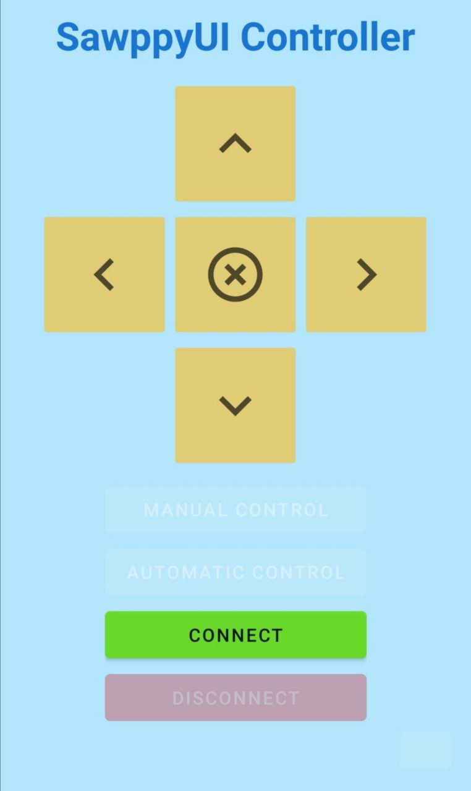

# Sawppy UI

This application is a small project to support communication (via Bluetooth) with the Sawppy rover. You can see all the
resources to build it in this repository ([Sawppy_Rover](https://github.com/Roger-random/Sawppy_Rover)). This application
is part of a university project, so it is not intended to be used in a real environment.

## How to use it

To use this app, you have 2 options:

- Download the APK file and install it on your phone (go to the
  [releases](https://github.com/scastd00/sawppy-ui/releases) page)
- Clone the repository and build the app yourself

## How to build it

To build the app, you need to have the Android SDK installed on your computer. It is recommended to use Android
Studio to build it.

## Requirements

Minimum Android version: 12 (API level 31)

## How to use it

When you open the application for the first time, you will be asked to enable Bluetooth. If you do not enable it, the
application will not work. Once Bluetooth is enabled, you will be asked to pair with the rover. To do this, you must
press the "Connect" button. If the bluetooth module is not enabled in the rover, you will not be able to connect to it.
Once you are connected, you can control the rover with the buttons on the screen.

## How does it work

The application communicates with the rover via Bluetooth. The rover has a Bluetooth module that allows it to receive
commands from the application. All the commands sent by the application are sent to the rover in the form of a JSON
string, with a number specifying the command to interpret when it is received by the rover. The rover has a
Bluetooth module that allows it to receive commands from the application.

## Images

